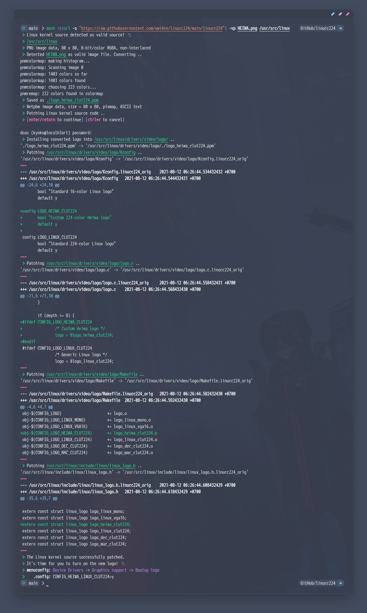
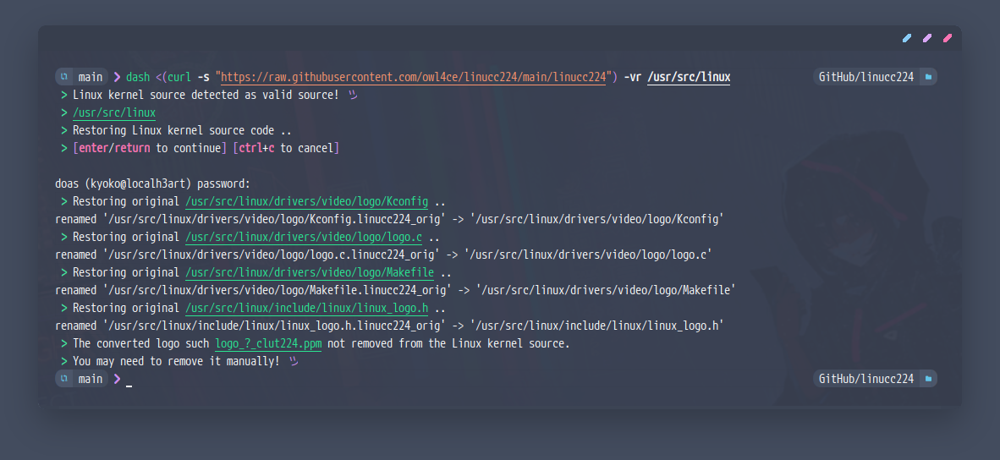
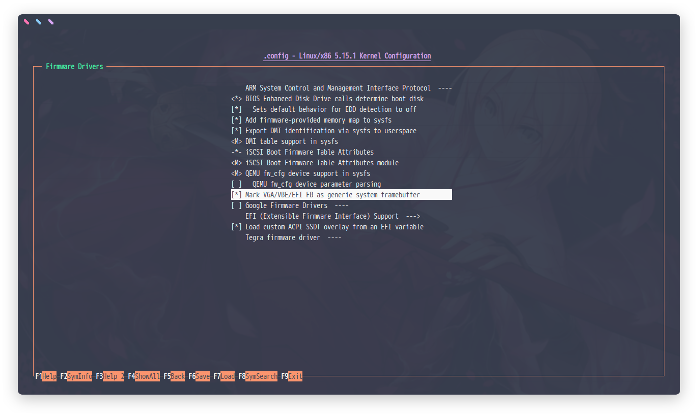
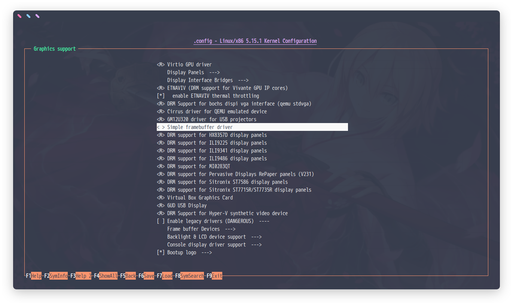
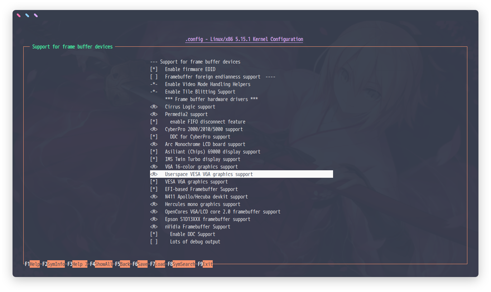
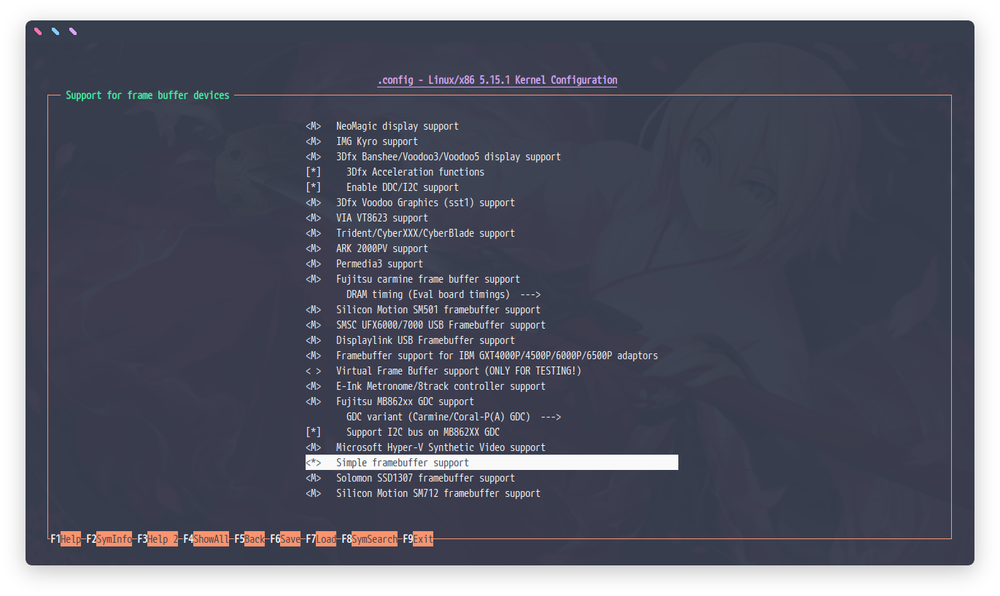
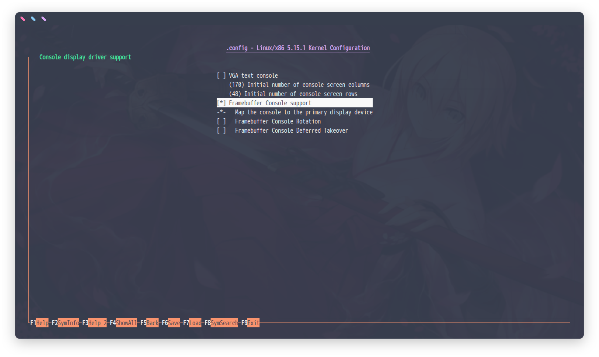
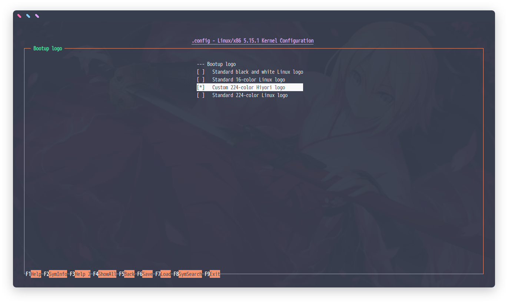
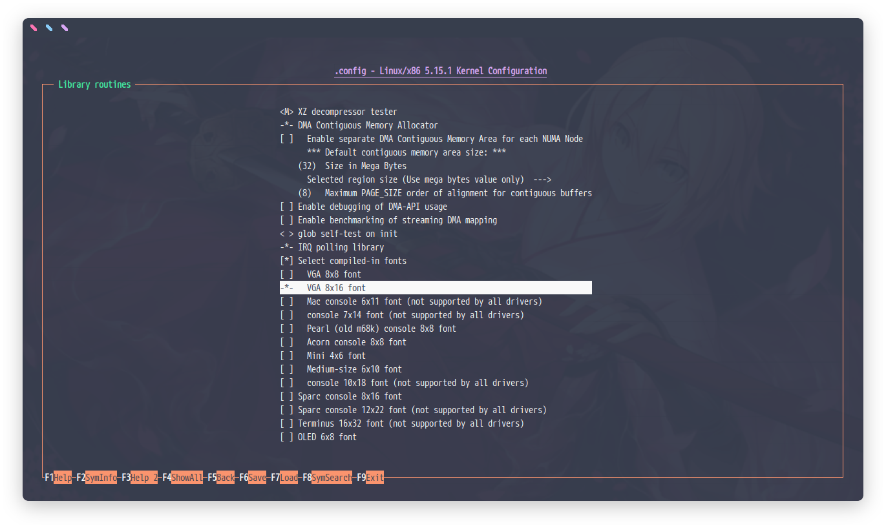

# <p align="center">`linucc224`</p>

<p align="center"><a href="#usage"></a></p>

##  
### Dependencies 
> **Required:**  
> `sh` `netpbm` `file` `coreutils` `grep` `sed` ( `doas` or `sudo` )
> 
> * *netpbm is required to convert from any image .ext into .ppm.*

> **Optional:**  
> `imagemagick` `diffutils`
>
> * *imagemagick is just for better image identification.*
> * *diffutils is only for verbose mode to view patch changes.*

##  
### Usage
```sh
$ sh <(curl -sL https://git.io/JPZNd) -h
```
```sh

* Easily add your own Linux framebuffer logo by patching it!

USAGE:
  linucc224 [options] /path/to/kernel_sources

OPTIONS:
  -p /path/to/your_logo			[    patch    ]
  -r					[ restore all ]
  -v					[   verbose   ]
  -h					[  show help  ]

https://github.com/owl4ce/linucc224

```

<details>
  <summary><strong>See patching in action</strong></summary>
  
  <br>
  <p align="center"></p>
  
</details>

<details>
  <summary><strong>See restoration in action</strong></summary>
  
  <br>
  <p align="center"></p>
  
</details>

##  
> Some [notes](https://github.com/owl4ce/hikari-x86_64/#note) if you use an image more than **80**x**80** pixels. That takes some crazy tricks.

> **How does it work?** :thinking:  
> It simply patches the Linux source code as seen in this [example diff](https://github.com/owl4ce/linucc224/commit/90ddf7e7e23da39946142749c0761d824d045b3f.diff) with a newly converted logo, flexibly based on your own logo file-name. So you can add the new logo continuously with different file-names.  
> 
> In order to purify the kernel source, it's reverted all except for the **.ppm** logo only.

> **Does this have any side effect on performance?** :thinking:  
> **Nothing**, unless the image size is too big, maybe it will make the kernel to load a bit longer on boot.

> I think, it works like a charm since **linux 3.2** onwards.

> :heavy_check_mark:   **`5.15.x`**

##  
### Follow this to enable framebuffer with new logo in the menuconfig / nconfig
> ##### `Device Drivers` 🡲 `Firmware Drivers`
> 
> <p align="center"></p>
> 
> ```cfg
> CONFIG_SYSFB_SIMPLEFB=y
> ```

> ##### `Device Drivers` 🡲 `Graphics support`
> 
> <p align="center"></p>
> 
> ```cfg
> # CONFIG_DRM_SIMPLEDRM is not set
> ```

> ##### `Device Drivers` 🡲 `Graphics support` 🡲 `Frame buffer Devices` 🡲 `Support for frame buffer devices`
> 
> <p align="center"></p>
>
> ```cfg
> CONFIG_FB_VGA16=m
> CONFIG_FB_UVESA=m
> ```
>
> <p align="center"></p>
> 
> ```cfg
> CONFIG_FB_SIMPLE=y
> ```

> ##### `Device Drivers` 🡲 `Graphics support` 🡲 `Console display driver support`
> 
> <p align="center"></p>
> 
> ```cfg
> CONFIG_FRAMEBUFFER_CONSOLE=y
> ```

> ##### `Device Drivers` 🡲 `Graphics support` 🡲 `Bootup logo`
> 
> <p align="center"></p>
> 
> ```cfg
> LOGO_YOURLOGO_CLUT224=y
> # CONFIG_LOGO_LINUX_CLUT224 is not set
> ```

> ##### `Library routines`
> 
> <p align="center"></p>
> 
> ```cfg
> CONFIG_FONT_8x16=y
> ```

##  
### Now what?
Of course rebuild the kernel. :disappointed_relieved:
> **Does it take a long time?**  
> **no**, if you have built the same kernel source before.
