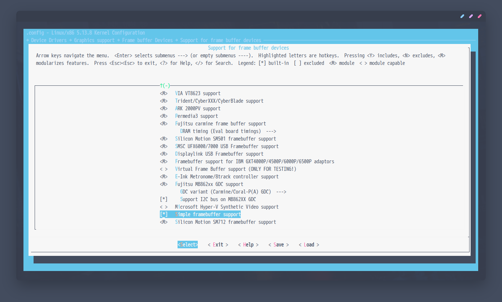
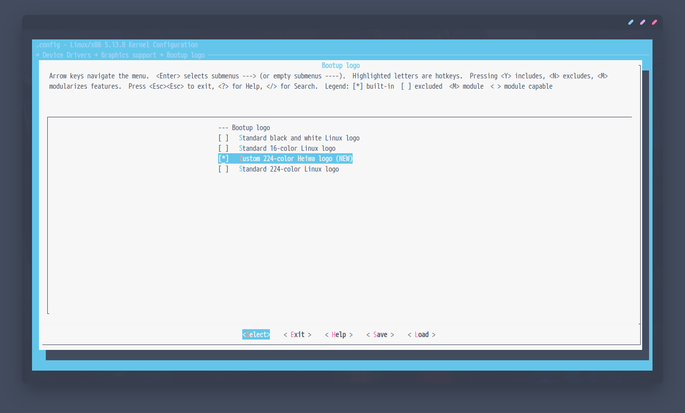

## <p align="center">`linucc224`</p>

##  
### Dependencies 
> **Required:**  
> `sh` `netpbm` `file` `coreutils` `grep` `sed` ( `doas` or `sudo` )

> **Optional:**  
> `imagemagick` `diffutils`
>
> * *imagemagick for better image identification.*
> * *diffutils for verbose mode to view patch changes.*

##  
### Usage
```sh
$ sh <(curl -s "https://raw.githubusercontent.com/owl4ce/linucc224/main/linucc224") -h
```
```sh

* Easily add your own Linux framebuffer logo by patching it!

USAGE:
  linucc224 [options] /path/to/kernel_sources

OPTIONS:
  -p /path/to/your_logo			[    patch    ]
  -r					[ restore all ]
  -v					[   verbose   ]
  -h					[    helps    ]

https://github.com/owl4ce/linucc224

```
> **How does it work?**  
> It patches the Linux source code as seen in this [example commit](https://github.com/owl4ce/linucc224/commit/90ddf7e7e23da39946142749c0761d824d045b3f.patch), flexibly based on your own logo filename.

> :heavy_check_mark: **Linux `5.13.x`**

##  
### Enable config

> `Device Drivers` -> `Graphics support` -> `Support for frame buffer devices`
<p align="center"></p>

> `Device Drivers` -> `Graphics support` -> `Console display driver support`
<p align="center"></p>

> `Device Drivers` -> `Graphics support` -> `Bootup logo`
<p align="center"></p>
